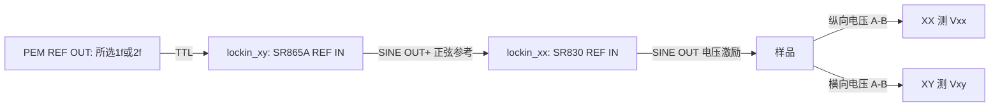

# Photonics / nonlinear Hall combination scan

## 持续照光 gate 扫描与直接跳转（2026-10-06）

用户批准的模式适用于 `order=["optical","smu","lockin"]`、PEM 外参考、
一个固定锁相激励点及 voltage-source 的 gate_top/gate_bottom。`smu_bias` 必须 off。
电流/电压、激光功率/电流、型号/谐波、参考状态和通信保护保持原规则。

在已有 `[combination_scan]` 中选择：

```toml
illumination_policy = "continuous_gate_scan"
```

可选值是 `off_before_axis_change`（省略时默认旧流程）和 `continuous_gate_scan`。
持续照光模式不支持 bias/current source、软件 pulse、温度/磁场轴或多个激励点。
每个 active gate 可以直接跳转，也可显式配置 ramp；旧模式仍可单独启用 ramp。

流程：确认关光 → 准备波长、功率和 PEM → 暗态选择固定锁相点并核验参考
→ 开光/闭环调功/完成一次 `nkt_run.dwell_s` → 设置第一个 gate。
组内后续 gate 持续照光，设置 gate 后等待 `three_smu_run.delay_s`，再进行电学/
锁相稳定等待与采样；固定锁相激励点重用并读回核验，不重复写激励或重新调功。
每个正式样本继续保存新鲜功率及 before/formal/after 检查，目标偏离按原
`target_deviation_policy` 处理。切换下一个光学点、结束及异常清理均先关光。
调功仍可能为调整激光电流而关开光。重复光学行/目标以及 repeats 均保留身份，
各自重新资格。

直接跳转示例（合并到已有计划子表，不要重复同名表）：

```toml
[three_smu_run.gate_bottom]
role = "sweep"
ranges = [{min=-30.0, max=30.0, scale="linear", points=11}]
bidirectional = false
zero_readback_tolerance_v = 0.05
```

删除整个 `[three_smu_run.gate_bottom.ramp]` 表及其四项参数，即每点只发送一次
目标电压。跨光学组的 +30 V → −30 V 也直接跳转。`zero_readback_tolerance_v`
是正常清理时实际回零的电压容差，持续照光 direct 模式必须显式设置，有限且 >0，
不得超过该 gate 的电压上限；示例 0.05 V 沿用当前样品原已批准的回零容差。
它不设置扫压步长，不增加正式点，也不更改电流限制。gate_top 使用同名参数。

每次 direct 写前及 `delay_s` 后读取新鲜实际 V/I、source register、output、
compliance 和错误状态，期间继续核验光照；原始检查进入审计，不增加正式样本。
写后 source register 必须等于请求目标；不符时保留目标/寄存器/实际读数并停止，
不自动放宽寄存器确认。扫点不另设实际电压与目标的偏差容差；实际 V/I 按原限值检查。
超流、限流、未知状态、通信或设置异常仍中断。lockin 的 record_continue
不能覆盖 SMU 保护。直接跳转及保护轮询不能保证没有更短的充电电流尖峰。

若以后恢复小步进，删除 direct 的 `zero_readback_tolerance_v`，再添加以下可选表：

```toml
[three_smu_run.gate_bottom.ramp]
max_step_v = 0.5
step_interval_s = 0.2
readback_tolerance_v = 0.05
timeout_s = 600.0
```

四项全部必填：均为有限正数，`readback_tolerance_v < max_step_v/2`。
启动、普通点、跨组回跳与正常回零采用已配置 ramp，每步保留新鲜保护检查。
`step_interval_s` 是最少等待，IO/功率守卫额外耗时；timeout 包括读回、等待和守卫，
不重置或放宽光学调功预算。中间点仅审计，不改变正式 points 数目。

正常 direct 清理直接请求 0 V，经等待及实际零点核验后关闭输出；ramp 清理仍
逐步回零。失败或状态不可信时优先关闭输出，保留最后确认读数和人工核验标记。
source register=0 或输出 OFF 均不能证明栅极电容已经放空。XX 测纯光学响应时
须按用户确认实际断开 SINE OUT→样品；4 mV 设置不能代替物理隔离。

LK_setup 当前计划保持5个波段×6个目标光强×11个gate（−30至+30 V），
共330个条件、每条件3次正式采样。每组仅进行一次光学资格流程，共30次；
锁相积分、h1/h2切换、settle及实际IO仍需等待。direct 变更只做离线验证和文件
部署，用户已停止的扫描不自动重启；此前停止后的实际栅压仍需人工核验。


## 波长设置 × 目标功率自动组合（2026-10-06）

以下片段合并进原有完整 TOML，其他仪器、反馈和安全参数继续保留：

```toml
[nkt_run]
points = [
  {source_level_pct = 25.0, wavelength_nm = 630.0, bandwidth_nm = 10.0},
]

[power_feedback]
target_mapping = "cartesian"
target_powers_w = [10e-6, 100e-6, 500e-6, 1e-3, 2e-3, 3e-3]
```

这段数组有6个功率，所以一条光学行自动生成1×6=6点；写5个功率才是1×5。
再添加一行不同波长（如650nm），即2×6=12点。按光学行在外、目标功率在内
展开：630nm依次六功率，然后650nm依次六功率。每行的初始电流、带宽、ND/PP
等完整设置随该行保留；不自动去重，也不把source_level_pct当成光功率。
示例数字沿用本次实验/语法说明，不为其他样品提供安全授权。

`target_mapping` 可选 `paired` / `cartesian`，省略默认 `paired`。旧模式的数组
仍须逐行对应，长度等于nkt_run.points；标量target_power_w两种模式均可用于
所有光学行。cartesian数组长度独立，所有展开的目标都须通过原功率/容差限值，
展开后的光学总点数最多10000。显式重复的光学行/功率会保留，计入总点数。
锁相激励轴、其他环境轴和重复次数在这之后继续组合；groups/sample不是功率点数。

读取和展开发生在离线加载阶段，预览会显示输入行数、模式和实际展开点数，
每个condition保存其波长/目标功率组合。原始TOML、输入行、展开计划和策略
都保留在运行快照。组合扫描及PEM诊断共用此点流程；独立光学旧循环不接受cartesian。

## 每个目标功率的起始电流（2026-10-06）

`power_feedback.initial_current_mode` 决定闭环调功从哪个电流设置开始，
不增加扫描轴，也不改变目标容差、稳定窗口、hold、总超时或正式功率采集。
开始发光后仍须用功率计实际测量并完成反馈资格检查；起始电流不是目标功率的保证。
电流单位是 NKT 驱动电流百分比，不是样品光电流，也不是光功率百分比。

| 模式 | `initial_source_levels_pct` | 含义与限制 |
|---|---|---|
| `point`，省略时默认 | 不得提供 | 每个点使用原 `nkt_run.points` 行的 `source_level_pct`；兼容 `paired` 和 `cartesian`。 |
| `previous` | 不得提供 | 只用于 `cartesian`。每条原始光学行第一点使用行内起始电流，其后使用上一合格点实测确认的电流。 |
| `per_target` | 一维数组，长度 N | 只用于 `cartesian` 且原光学行只有一条；第 j 个电流对应功率轴的第 j 个目标。 |
| `grid` | 二维数组，M 行 × N 列 | 只用于 `cartesian`；第 i 行对应原 `nkt_run.points` 第 i 条，第 j 列对应功率轴第 j 个目标。 |

M 是展开前的原始光学行数，N 是目标功率轴的长度；若使用标量
`target_power_w`，N=1。显式重复行/功率仍分别占一行/列，不能省略其电流值。
所有起始电流须为有限数字、以 0.1% 为步进，并落在
`source_current_min_pct..source_current_max_pct` 和 NKT 源允许区间内。
原行的 `source_level_pct` 也继续受原配置边界校验。
数组形状、模式组合和边界在打开仪器前校验，错误时不会开始发光。

下面片段替换完整配置中的对应表/字段；其余身份、接线和批准限值继续保留，
不要在同一 TOML 重复添加同名表或同名键。`previous`、`per_target` 和 `grid`
仅支持 `actuator="source_current"`，用于组合扫描和共用 OpticalPointSession 的
PEM 内参考诊断。独立 `optical_cli`/`optical_test` 的旧调功循环在资源构造前
拒绝这三种模式。保留旧入口时使用 `point` 及该入口原有的目标映射策略。

### 自动继承上一点：`previous`

```toml
[nkt_run]
points = [
  {source_level_pct = 25.0, wavelength_nm = 630.0, bandwidth_nm = 10.0},
  {source_level_pct = "CHANGE_ME_650NM_FIRST_CURRENT_PCT", wavelength_nm = 650.0, bandwidth_nm = 10.0},
]

[power_feedback]
actuator = "source_current"
target_mapping = "cartesian"
target_powers_w = [10e-6, 100e-6, 500e-6, 1e-3, 2e-3, 3e-3]
initial_current_mode = "previous"
# 不填写initial_source_levels_pct。
```

630 nm 的第一个功率从25%起步；若调功合格时读回29%，第二个功率从29%起步。
650 nm 的第一点重新用第二条光学行指定的起点，不能沿用630 nm最后一点的电流。
这里的650 nm起点未标定，必须把占位换成已确认的数字。
行身份以输入行号区分：即使两行波长相同，也不能自动跨行继承。
上一点失败、没有合格且确认的读回或访问乱序时，继承状态重置；
重新运行也不会从旧数据库恢复电流。只复用调功合格时确认的电流，不复用旧功率读数，
不把后续偏离目标的正式读数反过来当作新的标定。

### 单波长快速起步：`per_target`

```toml
[nkt_run]
points = [
  {source_level_pct = 25.0, wavelength_nm = 630.0, bandwidth_nm = 10.0},
]

[power_feedback]
actuator = "source_current"
target_mapping = "cartesian"
target_powers_w = [10e-6, 100e-6, 500e-6, 1e-3, 2e-3, 3e-3]
initial_current_mode = "per_target"
initial_source_levels_pct = [29.0, 39.2, 51.5, 63.0, 81.0, 99.0]
```

两个数组按位置对应：1 mW从63%起步；1个光学行×6个目标仍是6点。
这组六个电流来自2026-10-06的630 nm、10 nm带宽和当次光路实测，
只是可参考起点，不是其他波长/带宽/光路/样品的通用标定，也不自动批准这些电流。
3 mW对应99%已接近源上限，仍须确认配置允许并重新调功；不可据此向上越界。
该模式只接受一条原始光学行，防止默默把630 nm起点套用到其他波长。

### 多波长独立起步：`grid`

```toml
[nkt_run]
points = [
  {source_level_pct = 25.0, wavelength_nm = 630.0, bandwidth_nm = 10.0},
  {source_level_pct = "CHANGE_ME_650NM_FIRST_CURRENT_PCT", wavelength_nm = 650.0, bandwidth_nm = 10.0},
]

[power_feedback]
actuator = "source_current"
target_mapping = "cartesian"
target_powers_w = [10e-6, 100e-6, 500e-6, 1e-3, 2e-3, 3e-3]
initial_current_mode = "grid"
initial_source_levels_pct = [
  [29.0, 39.2, 51.5, 63.0, 81.0, 99.0],
  ["CHANGE_ME_650NM_P1_CURRENT_PCT", "CHANGE_ME_650NM_P2_CURRENT_PCT", "CHANGE_ME_650NM_P3_CURRENT_PCT",
   "CHANGE_ME_650NM_P4_CURRENT_PCT", "CHANGE_ME_650NM_P5_CURRENT_PCT", "CHANGE_ME_650NM_P6_CURRENT_PCT"],
]
```

这是2条原始光学行×6个功率，展开12点。二维电流表第一行对应630 nm，
第二行对应650 nm；两行各自六列依次对应同一功率轴。650 nm的电流未实测，
模板保留占位，不能把第一行复制过去冒充标定。增加或调整光学行、功率轴的顺序时，
必须同步调整电流表的行/列；shape不符会离线拒绝。

`per_target`和`grid`提供的电流直接用作该点起点；`previous`按点流程中的合格读回
选择起点。实际反馈后的电流可能不同，运行证据分别保存行内原始起点、所选起点、
选择模式和实际确认的电流。模式不改变功率计测量平面，也不改变每次改电流的
关光、设置、开光和读回验证流程。本功能只优化起点；反馈步长仍使用现有策略。

## 目标功率近似调节与实测功率采集（2026-10-06）

```toml
[optical_scan]
target_deviation_policy = "record_continue" # abort / record_continue；省略默认abort
```

目标功率用于初始调功；`target_tolerance_fraction`/`target_tolerance_w`、
稳定窗口、`hold_s` 和 `timeout_s` 仍决定何时完成调节。初始目标一直不可达或
功率窗口始终不稳定仍失败；此策略不允许无限调功或跳过初始资格。
调功成功后，在观察等待、重新资格确认、测量前/期间/后和参考恢复期间，
仅因偏离目标则保存偏差并继续，不改电流/ND，不拒绝该组 Vxx/Vxy。
功率硬上限、`reduce_above_power_w`、最低有效照明、功率计量程/状态、
设备设置与通信失败仍按原有规则停止和清理。

每组正式采样以组合 run/condition/attempt/sample ID 关联功率读数与锁相信号。
两个绘图 Notebook 使用仓库内正式 `src`，不依赖 `.test-tmp` 分析副本。
选择 SQLite 数据库后，在 Run IDs 选中需要的运行，再点 Load / refresh runs。
切换坐标、过滤和分组使用已加载的快照；再次点击加载才读取新的样本。
查看仍在运行或失败的记录须启用 Include rejected/problem records，通道质量筛选
仍然独立生效。导出保留加载时间和所选 run ID；继续采集不会向已加载的图混入新点。
Notebook 中 `target Optical source setting (%)` 不再是必须分组或固定的条件，
不会因不同起始激光电流阻止绘图。电流设定仍保存并导出，也可手动作为坐标、
分组或过滤。已有 setup 若明确按它分组，请将 Stack/group 改为 None，或改选
所需的波长/目标光功率。波长、带宽、光功率、栅压和频率等其他变化条件仍须
用坐标、分组或固定过滤说明；质量过滤和同一 condition 内的统计规则不变。
更新 notebook 后重新运行开头两格即可启用，不需要停止正在采集的扫描。
复现此绘图规则时请同时保留更新后的 notebook；导出 manifest 中的公共绘图模块
哈希本身不包含 notebook 分析进程内的这项分组规则。

`requested.optical_target_power_w` 是目标，`measured.optical_power_w` 是该组光学
模块的一次正式 PM READ；初始合格均值在 `status.optical.feedback.feedback_result`。
测量前/正式/后的原始功率和时间保留在 `status.optical.sample_brackets`，
`power_bracket_summary` 另外给出读数均值、标准差、最小/最大、序号与偏离次数，
不替代正式 READ，也不是同步或连续时间平均。功率计所在测量平面仍由配置说明，
不能自动当成样品处功率。各锁相通道和功率计保留自己的时间戳。

`optical_power_quality.target_in_tolerance`、`target_deviation_w`、
`target_deviation_fraction`、`target_deviation_continued` 是分析表中的信息列；
单纯偏离目标不令数据无效。以 `measured.optical_power_w` 作横轴分析 Vxx/Vxy，
波长、电激励、重复等条件继续用于分组；目标光强不作为该曲线的分组条件。
失锁/过载和失败运行的数据有效性仍按已有规则判断。

新记录采用 `requested-target-actual-power-v2` 标记，`actual.optical_target_power_w`
也保留真实目标；旧记录中该字段曾存实测功率，原始记录不重写。监控利用旧记录
已有的 `status.power_target_w` 分别显示目标和实测值。

此策略适用于组合扫描及共用 OpticalPointSession 的 PEM 内参考诊断。独立
`optical_cli`/`optical_test` 的旧扫描入口有自己的重新调功循环，显式拒绝
`record_continue`，不能把它与本次点流程策略混用。日常组合运行命令保持不变。

## 参考瞬态恢复（2026-10-05）

在 `[photonics_lockin]` 中可配置：

```toml
reference_transient_policy = "wait_stable" # abort（省略默认）/ wait_stable
reference_recovery_timeout_s = 45.0        # 有限正数，最大600秒
reference_recovery_consecutive_good = 3    # 1..100整数，每1秒检查
```

SR830 RANGE16（含与UNLK合并的24）、参考频率越界、参考链频差或SR865A
检测频率/谐波不一致先保存原始证据，再进入有限恢复。连续合格并确认锁定、
设置不变后，完成已有 `settle_time_constants × max(tau)` 滤波等待；等待仍检查
参考与光功率。同一失败操作的等待和重试共用截止时间，不因再次异常重置。
光学设定保持，不自动调功率或延长 `power_feedback.timeout_s`。

正式窗口包括光学/环境前检查、全部模块读数和后检查。任一环节的参考异常会
保存整个候选为拒绝审计记录，重新取得完整窗口；不拼接旧XX和新XY，不计入
要求完成的样本数。旧异常不会被后来的正常读数覆盖。`record_continue` 对
单纯过载/失锁仍按现有策略执行，失锁双路无效标记不会因恢复而消失。

真正设置变化、SR830 TC32、SR865A配置/滤波故障、未知状态、通信、光功率或
环境错误仍中止。恢复超时也中止并执行原有清理。监控中的恢复事件显示连续
合格次数、已用时间和剩余预算；它们是记录值，不是额外仪器连接。

最后更新：2026-10-05。本入口用一份实验 TOML 配置 NKT/VARIA、PEM、功率计和
两路锁相，由 combination scan 管理点顺序、正式采样、记录与清理。当前用户确认
**XX=SR830、XY=SR865A**；XX 提供样品激励并测 Vxx，XY 测 Vxy，同时为 XX 提供
正弦参考。旧文件中 XX=SR865A、XY=SR830 的描述属于此前检查点。

本轮已通过 SSH 查询两台锁相、PEM、PM100D、NKT/VARIA 的身份及当前设置，
没有写仪器设置、启动激光或执行扫描。只读查询不能代替完整级联和有光扫描验收。
接线、物理量定义及模板中的选项如下；样品允许激励和光功率等未知值
继续保留占位。

## 1. 当前参考连接与 `reference_topology`



XY 用的是 **SINE OUT+**，没有使用 BlazeX/Sync。XX SINE OUT 只接样品，
没有外部 50 Ω 终端；用户确认样品/串联电阻总负载远大于 50 Ω，因此
`source.load="high_impedance"`。光路是 NKT/VARIA、PEM 和经操作者
确认的样品/功率测量路径，不能从电参考接线推断光路或功率计测量平面。

`reference_topology` 表示参考时钟从谁传给谁，并选择对应的软件校验和保护流程。
它不会替你连接线缆，也不是选择 Vxx/Vxy 的信号输入。

| 值 | 物理连接与适用范围 |
|---|---|
| `pem_xy_xx_sine` | 当前路径：PEM → XY SR865A REF IN；XY SINE OUT → XX SR830 REF IN；XX SINE OUT → 样品。此版本要求这组型号。 |
| `pem_xx_xy` | 此前光学路径：PEM → XX 外部 TTL 参考；XX 同步输出 → XY 外部 TTL 参考；XY SINE OUT 断开。XX/XY 型号分别配置，包含已实现的双 SR865A 配置。 |
| `internal_xx_xy` | 旧双 SR830 电学路径：XX 内部参考及样品激励；XX TTL OUT → XY REF IN；XY SINE OUT 断开。使用旧电学配置，不把本光学模板直接切换到此值。 |

当前两路的参考配置必须同时写成：

```toml
[lockin_xx]
model = "SR830"
reference_source = "external_sine"
external_reference_edge = "sine_zero_crossing"
sine_output_connected = true

[lockin_xy]
model = "SR865A"
reference_source = "external_ttl"
external_reference_edge = "rising"
sine_output_connected = true
```

此片段只展示参考字段，不是完整配置。`sine_output_connected=true` 表示该路 SINE
OUT 有物理连线，因此两路都是 true；XY 的连线去 XX REF IN，不能误写成接样品。
`[photonics_lockin.reference_output]` 另外要求
`destination="lockin_xx_ref_in"`、`sample_connected=false`，明确其参考用途。
XX 的正弦过零触发对应 SR830 `RSLP=0`。收到 TTL 时才使用
`external_ttl` 配合 `rising`/`falling`，不能把正弦波标记成 TTL。

XY SR865A 在外参模式测 h2 时，SINE OUT 仍输出收到的外参考频率。PEM 选择
1f参考时，XX 的 h1约为50 kHz，XY的h2约为100 kHz；选择2f参考时，这两个
检测频率分别约为100 kHz和200 kHz。频差检查比较 XX `FREQ?`
与 XY `FREQEXT?`，不是 XY 的 `FREQDET?`。详见
[SR865A 手册外参/谐波说明，印刷页 75、79](https://www.thinksrs.com/downloads/pdfs/manuals/SR865Am.pdf#page=97)。

当前 `lockin_xy.sr865a.sync_output_mode="preserve"` 保留未使用的 BlazeX 模式，
不重写 BLAZEX。只有原 `pem_xx_xy` 路径使用 `unipolar_sync`/`bipolar_sync`，
其电平兼容性仍须按实际接法验证。

`photonics_lockin.reference_min_hz` / `reference_max_hz` 是这次实验允许的锁相外参考
区间，`reference_expected_hz` 是区间内的计划坐标，不会写入仪器强迫 PEM 改频。
`pair_tolerance_hz` 限制 XX↔XY、所选倍数×PEM机械基频↔XX/XY 的频差，不能把
两段误差相加后放宽。2026-10-05 按用户要求删除 `reference_min_hz × 0.001`
的配置上限，仅要求 `pair_tolerance_hz` 是有限正数；每次比较直接采用其配置值。
此光电配置还以同一基频容差检查 SR865A 顺序读回的
`FREQDET? / harmonic` 与 `FREQEXT?`，不再额外套用另一处固定的 1 ppm 判据；
两项真实读数及采用的容差都保留在审计中。独立驱动未传此参数时保留原判据。
实际频率仍须满足每路 `harmonic × f_ref` 的型号检测边界，谐波和状态检查不变。

### 1.1 PEM 2f参考与锁相检测阶数（2026-10-07）

`[photonics_lockin].pem_reference_harmonic` 只接受整数 `1` 或 `2`，省略默认
`1`，保留旧配置的1f行为。此项声明操作者已经在PEM硬件选择的参考输出倍数；
软件不发送 `:DET:HARMT`，也不会因为声明2f而自行切换硬件。
两路参考必须各自满足 `abs(f_ref - pem_reference_harmonic * f_PEM) <= pair_tolerance_hz`，
同时继续满足XX↔XY频差、允许频率区间、真实锁定/设置和型号检测能力检查。
该容差始终以收到的锁相参考Hz为单位，不自动翻倍。错误倍数进入原参考异常
策略；`wait_stable` 只在原有截止期限内恢复，不会绕过校验。

保持PEM 2f REF OUT → XY SR865A REF IN → XY SINE OUT+ → XX SR830 REF IN。
在已有表中修改下面字段，不要追加重复的同名TOML表；其余地址、激励幅值、
灵敏度、光功率和等待参数沿用这次实验批准的值：

```toml
[photonics_lockin]
pem_reference_harmonic = 2
reference_min_hz = 98000.0
reference_max_hz = 102000.0
reference_expected_hz = 100054.0 # 机械1f约50027 Hz的2f计划坐标

[pem]
frequency_min_hz = 49000.0
frequency_max_hz = 51000.0

[lockin_xx]
harmonics = [1]

[lockin_xy]
harmonics = [1, 2] # 也可只选[1]或[2]
```

| 参考输出 | 锁相h1 | 锁相h2 | XX SR830 |
|---|---|---|---|
| PEM 1f，约50.027 kHz | PEM 1f，约50.027 kHz | PEM 2f，约100.054 kHz | 可[1]或[1,2]，检测上限102 kHz |
| PEM 2f，约100.054 kHz | PEM 2f，约100.054 kHz | PEM 4f，约200.108 kHz | 只能[1]，h2在离线配置阶段拒绝 |

XY SR865A 可测新参考的h1/h2；软件仍只支持检测阶数1/2/3并逐阶检查能力。
PEM 的 `:MOD:FREQ?` 和 `[pem].frequency_min_hz/max_hz` 始终描述机械1f。
`optical_scan.peak_retardance_waves=0.5` 另外描述λ/2峰值延迟，不选择2f输出。
现有 `lockin_xx_h1_*` / `lockin_xy_h2_*` 数据列继续相对锁相参考命名，历史
数据不重标。新run的配置快照、轴metadata和原始角色事件保留参考倍数；正式
`harmonic_metadata`逐角色保存 `pem_reference_harmonic`、`pem_harmonic`、
`reference_frequency_hz` 和 `detection_frequency_hz`。PEM阶次来自倍数声明；参考频率
来自实际读回，SR830检测频率由该读回×检测阶次计算，SR865A检测频率由仪器查询。
原始样本中的 `detection_frequency_source` 保留这些来源，不能视为同时测得的频率。
启动摘要同时列出锁相阶数、对应PEM阶数和计划检测频率。
这些记录是软件校验和数据解释依据；实机2f锁定及完整扫描仍需单独验证。

## 2. 配置文件、默认入口与 backend

- [统一模板](../config/photonics.example.toml)：可复制为 ignored
  `config/hardware.local.toml`，或使用其他本机文件名并显式指定 `--config`。
- [锁相安全模板](../config/photonics_lockin_safety.example.toml)：复制为 ignored
  `config/photonics_lockin_safety.local.toml`，由统一配置的 `safety_file` 引用。
- 安全文件独立保存明确的 XX 激励上下限、清理幅值和每路允许的灵敏度档位；运行
  快照保存其哈希。旧 SR830 `lockin_safety.toml` 不能直接代替此型号感知安全文件。

不写 `--config` 时，combination 的 `run`、`describe-hardware`、`monitor` 默认读
**当前工作目录下的 `config/hardware.local.toml`**。不会因为存在 photonics 模板就
自动改读 `photonics.example.toml` 或 `photonics.local.toml`。命令中的 `--config`
明确选择文件；TOML 内的 `database_path`、`safety_file` 等相对路径再按配置文件
所在目录解释。

源模板不保存本机地址。LK_setup 上的同名未提交副本可以填入已核验地址、身份和
当前设置；此前其他实验的电流/功率限值不能变成本次样品的允许值。`CHANGE_ME`
使模板严格加载失败，填入语法示例不代表完成实机验收。

| 字段 | 含义和当前选择 |
|---|---|
| `project.mode="hardware"` / `combination_scan.backend="hardware"` | 选择真实组合执行路径；离线仿真使用独立 simulation 配置。 |
| `visa.backend="default"` | 创建 `pyvisa.ResourceManager()`，使用安装环境的默认 VISA 库；不是自动选择量程或默认实验设置。也可配置 `"@py"`（须安装 pyvisa-py）或已安装 VISA DLL 的明确路径。 |
| `visa.timeout_ms` | 锁相通信超时，单位 ms，正整数；不控制采样或稳定等待。 |
| `pm100d.backend="visa"` | 功率计使用 VISA 驱动；这里的 `visa` 是设备驱动类型，与上一项 VISA 库选择属于不同层次。 |
| `nkt_run.backend="nkt_sdk"` / `pem.backend="serial"` | 分别使用 NKT SDK、PEM 串口驱动；simulation 是相应离线驱动选项。 |
| `photonics_lockin.schema_version=1` | 本软件锁相配置结构的版本号，当前只支持整数 1；不是仪器型号、固件或测量次数。 |
| `combination_scan.order` | 外层 → 内层，例如 `["optical","lockin"]` 或 `["lockin","optical"]`；温度、磁场、SMU 轴需补齐各自配置。 |
| `samples_per_condition` / `repeats` | 每个条件的正式样本数、整张计划的重复次数，分别为 1–1000 整数，展开后的正式样本总量不超过 100000。 |
| `run_id` / `run_name` / `note` | `run_id="auto"` 或未使用过的明确 ID；其他两项记录实验名称、样品/光路和验收范围。 |

## 3. 锁相型号与输入参数

当前必须保留 `[lockin_xx.sr830]` 和 `[lockin_xy.sr865a]`。**仅把子表名称交换
并不足以更换型号**：还需同步 `model`、型号字段、源幅值定义、参考类型、物理
接线和每路谐波能力。上层始终使用 `lockin_xx`/`lockin_xy` 语义角色；适配器将
物理单位映射到各型号命令，不把 SR830 数字编码直接发送给 SR865A。

| 字段 | 含义、单位和软件支持范围 |
|---|---|
| `model` / `address` | 精确型号 `SR830`/`SR865A` 与实际 VISA 资源字符串；连接后校验型号身份。当前 SINE 拓扑限定 XX SR830、XY SR865A。 |
| `input_mode="a_minus_b"` | 样品信号输入 A−B，当前 profile 唯一支持的电压输入方式；与 REF IN 选择无关。 |
| `shield_grounding` | 信号输入屏蔽接地 `float`/`ground`。当前 `pem_xy_xx_sine` 接受已确认的两种设置；原 `pem_xx_xy` 仍要求 `float`。 |
| `input_coupling="ac"` | 信号输入交流耦合；当前软件只接受 ac。硬件 DC 的解释见下文。 |
| `time_constant_s` | 锁相输出低通时间常数，按型号离散档填写：SR830 从 10 μs、SR865A 从 1 μs 起，均为 1/3 系列直到 30000 s。 |
| `filter_slope_db_oct=24` | 当前只支持 24 dB/oct RC；没有启用 SR865A advanced/synchronous filter。 |
| `sensitivity_mode="fixed"` | 当前只支持固定量程，不接受旧电学 `bounded_auto`。 |
| `sensitivity_full_scale_v` | 解调输出的灵敏度/满量程，单位 V；使用型号可选离散档且必须在本路 safety allowlist。 |
| `phase_shift_deg` | 施加给解调参考的相位设置 PHAS，当前 −180°…180°；不是测得的 `phase_deg`，也不是自动相位标定。 |
| `harmonics` | 每路唯一升序列表，当前软件支持 1/2/3；例如 XX `[1]`、XY `[2]`。每个阶次分别检查实际检测频率。 |
| `sr830.reserve_mode` | `high_reserve`、`normal`、`low_noise`：SR830 的动态储备设置。 |
| `sr865a.input_range_v_peak` | 前端总输入的峰值范围 IRNG，选项 1、0.3、0.1、0.03、0.01 Vpeak。 |
| `sr865a.reference_input_impedance_ohm` | REF IN 的 50 Ω 或 1000000 Ω 阻抗；不是信号输入阻抗或样品负载。 |
| `sr865a.current_status_supported` | 只有实机确认 `CUROVLDSTAT?` 支持后才可写 true；正式采集要求 true，不能用 false 或缺失状态认定数据干净。 |

以 XY h2 为例，`sensitivity_full_scale_v=0.002` 表示当前检测阶次的解调输出
满量程为 2 mV。它不等于输入中所有频率、DC 和干扰的总幅值上限。SR865A 的
`input_range_v_peak` 控制前端可接收的**总输入峰值**，包括目标频率以外的分量；
前端过载时，即使 h2 很小也不能认为测量有效。IRNG 与 SR830 的
`low_noise`/`normal` 不存在一一对应关系：一个是输入范围，一个是动态储备设置。
这两项也都不是 XX 施加到样品的激励幅值。

### 3.1 SR865A 完整电压灵敏度档位

当前 A−B 电压输入使用 `sensitivity_full_scale_v`，单位 **V**。SR865A 共 28 档，
从 1 nV 到 1 V；不是连续可调数值。适配器把 V 数值转换为下面的 `SCAL` 编号，
TOML 应填第三列的数值，不能填编号。例如 20 mV 写 `0.02`，5 μV 写 `5e-6`。
表按 [SR865A 官方手册](https://www.thinksrs.com/downloads/pdfs/manuals/SR865Am.pdf)
修订 2.11、印刷页 113 的 SCAL 命令核对，并与 `sr865a_settings.SENSITIVITIES_V` 一致。

| SCAL 编号 | 电压满量程 | TOML 数值（V） |
|---|---|---|
| 0 | 1 V | `1.0` |
| 1 | 500 mV | `0.5` |
| 2 | 200 mV | `0.2` |
| 3 | 100 mV | `0.1` |
| 4 | 50 mV | `0.05` |
| 5 | 20 mV | `0.02` |
| 6 | 10 mV | `0.01` |
| 7 | 5 mV | `0.005` |
| 8 | 2 mV | `0.002` |
| 9 | 1 mV | `0.001` |
| 10 | 500 μV | `500e-6` |
| 11 | 200 μV | `200e-6` |
| 12 | 100 μV | `100e-6` |
| 13 | 50 μV | `50e-6` |
| 14 | 20 μV | `20e-6` |
| 15 | 10 μV | `10e-6` |
| 16 | 5 μV | `5e-6` |
| 17 | 2 μV | `2e-6` |
| 18 | 1 μV | `1e-6` |
| 19 | 500 nV | `500e-9` |
| 20 | 200 nV | `200e-9` |
| 21 | 100 nV | `100e-9` |
| 22 | 50 nV | `50e-9` |
| 23 | 20 nV | `20e-9` |
| 24 | 10 nV | `10e-9` |
| 25 | 5 nV | `5e-9` |
| 26 | 2 nV | `2e-9` |
| 27 | 1 nV | `1e-9` |

**硬件支持不等于本次实验已经允许。** 实际可填范围是上述离散档与 `safety_file`
中对应角色 `allowed_fixed_full_scales_v` 的交集。例如 XY 安全文件没有 `5e-6`
时，填入该档仍会在连接硬件前拒绝。此表的补充不扩充安全白名单；也不改变独立的
`input_range_v_peak`（IRNG）。SR830 的完整 27 档（2 nV–1 V）见
[SR830 全部硬件量程表](LOCKIN_DAILY_OPERATION.md#sr830-全部硬件量程与项目安全白名单)；
其中原电学路径的白名单不能代替当前 photonics 的独立 safety 文件。

### 3.2 SR830 动态储备模式

SR830 的选项必须写在 `[lockin_xx.sr830]` 下的 `reserve_mode`，不放在上层
`[lockin_xx]` 或 `[lockin_xy.sr865a]`。当前代码已支持全部三项，字符串区分大小写。

| TOML 选项 | 前面板名称 / RMOD | 含义 |
|---|---|---|
| `"high_reserve"` | High Reserve / 0 | 当前灵敏度档下的最大可用动态储备。 |
| `"normal"` | Normal / 1 | 当前灵敏度档下的中间动态储备。 |
| `"low_noise"` | Low Noise / 2 | 当前灵敏度档下的最小可用动态储备。 |

动态储备描述容纳非目标频率干扰的能力；实际 dB 取决于灵敏度档，某些档位下三种
模式的储备相同。它不是解调满量程，也不等于 SR865A 前端输入范围。模式定义及
每档的实际储备见 [SR830 官方手册](https://www.thinksrs.com/downloads/pdfs/manuals/SR830m.pdf)
印刷页 4-7–4-8；RMOD 命令见 5-6。

```toml
[lockin_xx.sr830]
# 可选 "high_reserve"、"normal"、"low_noise"；只保留一个有效赋值。
reserve_mode = "low_noise"
```

改成 normal 时只替换最后一行的字符串，无需增设模式参数或修改适配器。SR865A
子表保持其独立的 `input_range_v_peak`，不添加 `reserve_mode`。

### 3.3 输入耦合与参考相位

AC 耦合通过输入高通抑制 DC 和低频分量，DC 耦合保留这些分量，使它们也占用前端
余量。约 50 kHz 信号通常远高于输入高通截止频率，但实际 DC 偏置、背景和过载
仍须确认。**当前 photonics 软件仅支持 ac**；仪器有 dc 选项不表示直接改 TOML
即可启用。输入 `input_coupling` 与 SINE OUT 的 DC offset 是两套独立设置。
输入范围、耦合和输出灵敏度的仪器定义见
[SR865A 官方手册](https://www.thinksrs.com/downloads/pdfs/manuals/SR865Am.pdf)。

PHAS 调整解调参考，不用于控制 SINE OUT 的物理输出相位。HARM 选择检测倍频，
不把 SINE OUT 基频变成 n 倍频。因此 XY 测 h2 时，给 XX 的 SINE OUT 仍传递
PEM 的基频；约 50.027 kHz 下 XX SR830 的 h3 约 150.08 kHz，超过 102 kHz，
必须拒绝。XY SR865A 不受这个 SR830 上限约束，但仍受其自身 4 MHz 检测边界、
本软件阶次范围和实际参考检查约束。源频率和谐波定义见
[SR830 官方手册](https://www.thinksrs.com/downloads/pdfs/manuals/SR830m.pdf)、
[SR865A 官方手册](https://www.thinksrs.com/downloads/pdfs/manuals/SR865Am.pdf)。

本轮 XY 的 PHAS 读回来自其当时 h1 状态；把读回值填入配置并不表示完成 h2
相位标定。正式测量前仍需按实际接线和检测阶次确认相位约定。

## 4. 样品激励 source 与 XY 正弦参考 reference_output

`[photonics_lockin.source]` 管理 **XX → 样品**，参与幅值扫描和清理。
`[photonics_lockin.reference_output]` 管理 **XY → XX REF IN**，只核验/保留当前
输出，不扫描、不降低其幅值。把两者分开是为了避免清理样品激励时切断参考链。

| 字段 | 可选值与意义 |
|---|---|
| `wiring` | `single_ended` 为单端接法；`differential` 为使用两端的差分接法。当前 XX SR830 仅支持 single_ended，XY SINE OUT+ 的确认接法也填 single_ended；SR865A 源契约另有 differential 选项。 |
| `load` | `50_ohm` 为确认的 50 Ω 外部负载；`high_impedance` 为确认的高阻外部负载。用户已确认 XX 的样品/串联电阻总负载远大于 50 Ω，当前填 high_impedance。其他实验不能仅凭“无外部终端”推断高阻。当前 XY 直接接 SR830 REF IN 的参考契约只接受 high_impedance。 |
| `amplitude_definition` | XX SR830 使用 `sr830_instrument_rms_setting`；SR865A 使用 `differential_rms_into_50_ohm_loads`，声明 SLVL 的仪器幅值定义，而非声称当前线缆真的为差分/50 Ω。 |
| `dc_mode` | SR830 使用 `not_supported`。SR865A 使用 `common`（两端相同 DC）或 `difference`（两端相反 DC）；参考输出填写实际 REFM 读回。 |
| `dc_offset_v` | 源 DC 偏置，单位 V；当前只接受确认的 0.0。与输入 AC/DC 耦合无关。 |
| `reference_output.amplitude_v_rms` | XY 当前 SLVL 设置，1e−9…2.0 Vrms；程序核验设置匹配，不自动写入。 |
| `reference_output.destination` / `sample_connected` | 当前只接受 `lockin_xx_ref_in` 与 false，声明 XY 输出不接样品。 |

SINE OUT 的显示/SLVL 值不自动等于样品端 RMS。源输出阻抗、单端/差分接法、
外部终端、样品及串联电阻共同决定实际端电压/电流；需用确认的电路关系或测量
换算。本次已确认 XX 总负载为高阻，但未测定具体分压，不能据此推断样品端
电压或电流。
软件保存仪器设置和接法，安全文件对该已确认源契约限制幅值及清理值。
SR865A 差分幅值与负载定义见
[官方手册](https://www.thinksrs.com/downloads/pdfs/manuals/SR865Am.pdf)。

## 5. 明确激励点与区间 points

`[lockin_sweep]` 的两种写法**互斥**：选明确数组，或选 `excitation_ranges`。
下面数字只说明语法，正式值须在本样品确认的 XX source safety 范围内。

```toml
# A：明确点，保持输入顺序和重复点。
[lockin_sweep]
excitation_points_v_rms = [0.004, 0.01, 0.02, 0.01]
```

```toml
# B：线性等分，包含两端，共 10 点。
[lockin_sweep]
excitation_ranges = [{min=0.004, max=0.04, scale="linear", points=10}]
```

```toml
# C：线性步长；step 与 points 二选一，step 必须整除区间。
[lockin_sweep]
excitation_ranges = [{min=0.004, max=0.04, scale="linear", step=0.004}]
```

```toml
# D：对数等分，只接受 points，端点均须为正。
[lockin_sweep]
excitation_ranges = [{min=0.004, max=0.04, scale="log", points=10}]
```

多段区间放在一个数组，按升序排列、不重叠、不共享端点；展开点数不超过 100000。
当前光电区间不接受旧电学范围里的逐段量程覆盖字段，各路量程由 `lockin_xx` /
`lockin_xy` 统一固定配置。清理幅值还必须不高于扫描中最低激励；不能仅改点表
而忽略安全文件的下限、上限及清理值。

## 6. 光学接口和参数含义

NKT 的 `address` 是同一 SDK 串口设备链上 **1–255 的整数模块 ID**，不是 IP、
COM 号或序列号。例如 `address=29` 说明格式，不能用字符串 `"COM<端口号>"` 代替。
`expected_serial` 是对应模块读回的序列号字符串，保留前导零；EXTREME 与 VARIA
分别填写各自的 ID/序列号。地址必须来自既有设备树或只读核验，不能猜默认值。
本轮在 CONTROL 关闭后已成功只读核对二者，当前 emission 读回为 OFF；当前电流、
滤波中心、ND 等设置属于状态快照，不能拿来填样品允许上限或批准扫描点。

| 表 / 字段 | 含义和填写方式 |
|---|---|
| `nkt_source.control` | `current` 或 `power`；本模板的 source_current 反馈要求 current，不能只改这个字段切换控制路径。 |
| `nkt_source.max_level_pct` | 本实验批准的源百分比上限；当前模板为电流控制，因此单位是电流 %，不是 W。 |
| `nkt_source.dll_path` / `port` / `address` / `expected_serial` | 已核验 SDK DLL 路径、单个 COM 端口、EXTREME 模块 ID、EXTREME 序列号。 |
| `allowed_pp_ratios` | 空列表表示保留已有 pulse picker，点表也应省略该字段；不自动替实验选择分频。 |
| `nkt_varia.monitor_present` | 是否存在且确认可用的 VARIA 百分比 monitor；其百分比不是独立的 W 功率计。 |
| `nkt_varia.nd_control_verified` | ND 控制是否经过相应实机验证；未验证时不能作为闭环执行器。当前 source_current 模板保留 ND。 |
| `nkt_varia.address` / `expected_serial` | VARIA 自己的整数模块 ID 和序列号，不能填激光源的身份。 |
| `nkt_run.mode` / `emit` / `manual_route` | 当前用 varia_bandpass；emit=true 才计划有光测量，仍须命令光学授权；manual_route 明确实际光路、衰减和测量位置。 |
| `nkt_run.timeout_s` / `poll_interval_s` | NKT 操作超时及状态轮询间隔，单位 s；轮询间隔不超过超时。 |
| `nkt_run.dwell_s` | 反馈合格后的额外观察时间，单位 s；期间不自动调功率，与 feedback hold 不同。 |
| `nkt_run.points` | 显式光学行：初始 source_level_pct、wavelength_nm、bandwidth_nm；源 % 不是目标 W。VARIA 中心/两边沿须在 400–840 nm，带宽 10–100 nm。 |
| `output_directory` / `run_name` / `note` | 光学记录目录和元数据；目录相对配置文件，另由组合记录保存共享 condition/audit。 |
| `pem.port` / `expected_idn` | 实际 COM 端口和完整精确身份字符串；驱动固定 250000 baud。 |
| `pem.io_timeout_s` / `settle_timeout_s` / `poll_interval_s` | 串口超时、PEM 稳定总超时、稳定轮询间隔，单位 s。 |
| `pem.wavelength_min_nm` / `wavelength_max_nm` | 已确认 PEM 头部的工作波长区间，不沿用其他头部或光路的范围。 |
| `pem.amplitude_min_nm` / `amplitude_max_nm` / `amplitude_tolerance_nm` | 允许延迟幅值范围与读回容差，单位 nm；延迟不是驱动电压，也不是 waves。 |
| `pem.frequency_min_hz` / `frequency_max_hz` | PEM 当次读回基频的允许范围，单位 Hz。 |
| `pem.finish_action="disable_ack"` | 仅在 XX 源保护确认后执行结束策略；disable ACK 不证明物理停振已测量确认。 |
| `pm100d.resource` / `expected_serial` / `expected_sensor_serial` | VISA 资源、控制器 IDN 序列号、传感器身份序列号分别核验，不能混用。 |
| `pm100d.io_timeout_s` / `wavelength_tolerance_nm` | 功率计通信超时 s、波长校正设置读回容差 nm。 |
| `pm100d.average_count` / `auto_range` / `range_w` | 内部平均次数为 1–1000000 整数；auto_range=false 时另外提供明确量程 range_w，单位 W。 |
| `pm100d.max_power_w` / `measurement_plane` | 该实际测量平面的硬功率上限 W、明确位置；探头功率不自动等于样品处功率。 |
| `optical_scan.mode` / `use_pem` / `use_power_meter` | power_stabilized 做目标 W 反馈；direct 不做目标闭环，需移除反馈表。此参考链要求 use_pem=true，有 W 反馈还要求功率计。 |
| `peak_retardance_waves` | 峰值延迟波数，延迟 nm = 波长 nm × waves；0.25 waves 为已确认目标，仍需满足 PEM 允许延迟范围。 |

功率反馈的 `actuator="source_current"` 通过源电流调功率，保留并检查 ND 和 pulse
picker，点表不要添加这两项。`varia_nd` 需要另行确认 ND 控制和对应边界。
`target_power_w`（所有光学行共用）与 `target_powers_w`（逐行对应）二选一；
`target_tolerance_fraction`（例如 0.05=5%）与 `target_tolerance_w`（绝对 W）也二选一。
目标加容差须不超过反馈 `max_power_w`，后者又不能超过功率计硬上限。

`source_current_min_pct`、`source_current_max_pct`、`source_current_step_pct`
限制反馈允许的电流区间与步长，不能超过 NKT 源上限；`minimum_signal_power_w`
限制可认定为有效照明的最低 W，低于它时拒绝，不自动加电流寻找光。
可选 `reduce_above_power_w` 是 source_current 的软降功率阈值，位于目标加容差
与硬上限之间，不能替代硬上限。`timeout_s` 限制整段反馈时间；`hold_s` 要求
达到稳定后继续保持；`window.duration_s`、`min_samples`、`max_peak_to_peak_w`
共同判断滚动窗口的时长、数量和绝对峰峰波动，后者不是标准差或目标误差比例。

## 7. 功率 × 波长 × 激励点表

默认 `target_mapping="paired"` 使用显式 `nkt_run.points` 行，
`power_feedback.target_powers_w` 按相同行号对应。二维光学点表例如：

| 光学行 | 波长 | 目标功率 |
|---|---|---|
| 0 | λA | PA |
| 1 | λA | PB |
| 2 | λB | PA |
| 3 | λB | PB |

模板默认paired，四行光学点对应 `[PA,PB,PA,PB]`，两者长度必须相等。
改用 `target_mapping="cartesian"` 时，每个波长/带宽设置只写一行，
功率数组只写一次；两条光学行×两个功率同样生成上表四个坐标。
固定功率可用一个 `target_power_w`，固定波长首次测试可用一行×一个目标。
`initial_current_mode` 的上一点继承、一维/二维起点表见前面的起始电流章节；
它们只选择初始电流，不增加光学点数。

`order=["optical","lockin"]` 在每个光学坐标下扫电激励；反过来则在每个电激励
下扫光学表。四行光学点、两个激励点、一次重复产生八个 condition，每个条件
重新测量，不能复用外层旧读数。PEM 决定参考基频，此 profile 仅支持
`lockin_mode="excitation"`，不通过此入口独立扫 XX 内部频率。

记录中的 requested optical power 是目标 W，measured 和 actual optical power
是指定测量平面的正式实测 W；源百分比的 requested 是初始值，actual 是反馈后
实际设置。`direct` 模式不自动生成实测功率。

## 8. 三个 sample_interval 与实际逐点时序

`photonics_lockin.overload_policy` 可选 `abort`（省略时默认）或
`record_continue`。本次用户已明确选择后者：XX SR830 与 XY SR865A 的输入和
输出量程过载均保留原始状态并继续，包括启动、转换、资格检查及正式采样。
正式数据分别记录 `valid_for_analysis_by_role`；过载通道及其采样前后检查窗口
影响的读数不进入默认分析，正常的另一通道仍可使用。`clean=false` 与
`overload_continuation=true` 表示记录了诊断数据，不等于无过载的有效测量。
参考失锁由独立的 `photonics_lockin.reference_unlock_policy` 控制，可选
`abort`（省略时默认）或 `record_continue`。当前用户明确选择后者：当前失锁和
读取后清除的历史锁存都记录原始状态并继续。任何正式样本或其前后/转场检查
出现失锁，说明共同参考链受影响，该组 Vxx/Vxy 两路均标为无效，默认分析排除；
原始诊断数值继续保存。`reference_unlock_continuation=true` 表示保留了失锁数据，
不会把旧 rejected 运行重新解释成成功。
参考等待仍每1秒检查，最多45秒；record_continue 在未锁定超时时保存事件与
最后状态，再继续原频率检查。abort 策略仍超时中止。频率必须在批准区间内，
两台差值仍须满足 pair_tolerance_hz；无有效频率读回仍拒绝。
通信/仪器错误、未知状态、开机事件、SR865A 同步滤波故障、设置或激励变化及
频率/光功率异常仍停止扫描；两种继续策略不会放大量程或提高光功率上限。

| 设置 | 用在什么阶段 |
|---|---|
| `photonics_lockin.reference_unlock_policy` | `abort`（默认）或 `record_continue`。后者保存当前/锁存失锁及等待超时并继续；受影响的正式 Vxx/Vxy 两路都排除出默认分析。 |
| `photonics_lockin.reference_lock_timeout_s` | 外参考设置或 PEM 变化后的锁定轮询超时，例如 45.0 s。立即检查一次，此后按 1 s 间隔检查两台状态，锁定且频率一致就继续，不固定等待 45 s；查询耗时计入超时。激光保持关闭、XX 保持保护幅值。过载按 overload_policy 处理，错误或未知状态立即停止。每轮原始状态及开始/结束事件均保存；原滤波稳定等待仍保留。省略或 0 保留原转换检查而不额外轮询。旧字段 reference_lock_wait_s 兼容为同一超时含义，两字段不能同时出现。 |
| `photonics_lockin.settle_time_constants` | 电学状态/阶次变化后等待的倍数；当前至少 10，实际等待 = 倍数 × max(XX tau,XY tau)。例如两路最大 tau=1 s、倍数=15 时为 15 s。 |
| `photonics_lockin.sample_interval_s` | 同一条件第二次及后续正式电学样本前的额外间隔，直接填秒；用途对应旧 sample_interval_time_constants，而非 settle_time_constants。阶次变化仍另需滤波稳定等待。 |
| `power_feedback.window.sample_interval_s` | 调功率和 hold 阶段读 PM100D 的间隔，参与滚动功率窗口；不控制电学采样频率。 |
| `optical_scan.sample_interval_s` | 功率反馈合格后，在 nkt_run.dwell_s 额外观察阶段检查光学状态/功率的间隔；不启动后台连续反馈。 |

**同一个正式电学条件的采样期间维持有光，并检查光学状态和功率；整段激励扫描
不是从头到尾不关光的运行。** 当前每次光学、电学、温度、磁场或 SMU 轴变化前
都先确认激光 OFF。因此即便光学是外层、波长/功率坐标相同，切换激励后也会重新
打开并完成有界功率资格检查，随后采这个新的 condition。

典型一个条件的次序为：

1. 所有启用模块先预检；确认激光 OFF。改变 PEM 前先把 XX 降至明确的保护幅值。
2. 准备光学坐标、PEM 延迟和功率计波长校正；PEM 稳定后，在 XX 仍保护时检查
   PEM、XY、XX 的实际基频，再恢复本点激励并等待/检查锁相。
3. 激光发光，反馈调至目标功率并满足窗口/hold，再完成 dwell 观察；随后再次完成
   锁相资格及参考频率检查，才进入正式采样。
4. 在正式窗口前、光学读取及窗口后检查功率/状态，顺序读取 Vxx/Vxy 和配置阶次。
   失锁、未知状态或功率离开目标时拒绝条件，保留原始证据，不在正式窗口内调功率。
5. 进入下一轴变化前再次关闭激光。结束时先尝试确认 NKT OFF，再保护 XX；只有
   XX 保护验证成功才执行 PEM 结束策略。

Vxx/Vxy 仍是顺序采样，共同 condition 不表示硬件同时采样；每次仪器读取都有
时间戳。功率检查是记录的离散窗口证据，不保证两次读取之间的连续光功率已测得。
若 XX 清理失败或状态未知，保留参考并标记 `reference_left_active_or_unknown`，
关闭通信后要求人工确认。一个设备清理失败不阻止其他设备独立清理尝试。

加入环境轴时，本 profile 对目标、转场、实际读回及清理均保持
`sqrt(Bx²+Bz²) <= 3 T`，包含纯轴目标。通信失败后保留最后确认值，绝不推断场为零。

## 9. 命令与当前验收边界

先确认 Python 导入的是这个集成 checkout 的 `src/attodry_control`。填完配置及
安全文件后，以下命令仅解析、检查边界和列出条件，不打开硬件：

```powershell
python -m attodry_control.combination_cli describe-hardware --config config/hardware.local.toml
```

若使用独立 `config/photonics.local.toml`，显式把 `--config` 换成该路径。
真实运行要求当次明确授权、确认光路/样品电光边界及对应 commissioning；语法为：

```powershell
python -m attodry_control.combination_cli run --config config/hardware.local.toml --authorize-optical --confirm-optical-route
```

`run` 命令本身授权配置中选择的模块，光学另外要求上述两个标志；本文没有执行
此命令。当前 SINE 拓扑不会要求 XY SINE OUT 断开，而是严格核验它只去 XX REF IN
且 `sample_connected=false`。未知样品边界或 `CHANGE_ME` 仍会拒绝，不关闭保护。

监控仅读取登记的 SQLite/文件，不另开仪器连接：

```powershell
python -m attodry_control.combination_cli monitor --config config/hardware.local.toml --once
```

本轮只读查询取得各模块身份、锁相耦合/量程/相位/源设置，及 NKT/VARIA 当前状态。
SR865A 的 `CUROVLDSTAT?` 已确认可读；SR830 未消费状态锁存，NKT 没有写命令或
发光。不同时间的单次频率读回不能证明整段稳定同步：其中一次 PEM 与 XX 的差
约 0.545 Hz，超过模板 `pair_tolerance_hz=0.5`，不自动放宽容差或宣称正式验收。
此值需要后续有范围的连续参考资格检查，且不能替代锁定状态、电平裕量和有光验证。

统一记录保留请求/读回、实测功率、PEM 延迟/频率、各路阶次、X/Y/R/相位、状态、
原始通信、配置/软件版本和清理。零幅值对应的未定义相位不伪造为零；默认分析仅
接收 completed/accepted/clean 数据，失败、部分采集与清理失败证据保留用于审计。
历史记录按其归档配置解释，不因当前型号和接线变化而重新认定有效。

项目整体状态见 [集成工作包](modules/INTEGRATION_PHOTONICS_NONLINEAR_HALL.md)、
[当前交接](PROJECT_HANDOFF.md) 与 [硬件安全说明](HARDWARE_AND_SAFETY.md)。
