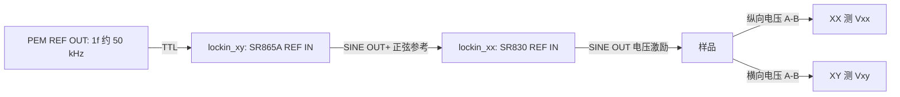

# Photonics / nonlinear Hall combination scan

最后更新：2026-10-05。本入口用一份实验 TOML 配置 NKT/VARIA、PEM、功率计和
两路锁相，由 combination scan 管理点顺序、正式采样、记录与清理。当前用户确认
**XX=SR830、XY=SR865A**；XX 提供样品激励并测 Vxx，XY 测 Vxy，同时为 XX 提供
正弦参考。旧文件中 XX=SR865A、XY=SR830 的描述属于此前检查点。

本轮已通过 SSH 查询两台锁相、PEM、PM100D、NKT/VARIA 的身份及当前设置，
没有写仪器设置、启动激光或执行扫描。只读查询不能代替完整级联和有光扫描验收。
接线、物理量定义及模板中的选项如下；样品允许激励和光功率等未知值
继续保留占位。

## 1. 当前参考连接与 `reference_topology`



XY 用的是 **SINE OUT+**，没有使用 BlazeX/Sync。XX SINE OUT 只接样品，
没有外部 50 Ω 终端；用户确认样品/串联电阻总负载远大于 50 Ω，因此
`source.load="high_impedance"`。光路是 NKT/VARIA、PEM 和经操作者
确认的样品/功率测量路径，不能从电参考接线推断光路或功率计测量平面。

`reference_topology` 表示参考时钟从谁传给谁，并选择对应的软件校验和保护流程。
它不会替你连接线缆，也不是选择 Vxx/Vxy 的信号输入。

| 值 | 物理连接与适用范围 |
|---|---|
| `pem_xy_xx_sine` | 当前路径：PEM → XY SR865A REF IN；XY SINE OUT → XX SR830 REF IN；XX SINE OUT → 样品。此版本要求这组型号。 |
| `pem_xx_xy` | 此前光学路径：PEM → XX 外部 TTL 参考；XX 同步输出 → XY 外部 TTL 参考；XY SINE OUT 断开。XX/XY 型号分别配置，包含已实现的双 SR865A 配置。 |
| `internal_xx_xy` | 旧双 SR830 电学路径：XX 内部参考及样品激励；XX TTL OUT → XY REF IN；XY SINE OUT 断开。使用旧电学配置，不把本光学模板直接切换到此值。 |

当前两路的参考配置必须同时写成：

```toml
[lockin_xx]
model = "SR830"
reference_source = "external_sine"
external_reference_edge = "sine_zero_crossing"
sine_output_connected = true

[lockin_xy]
model = "SR865A"
reference_source = "external_ttl"
external_reference_edge = "rising"
sine_output_connected = true
```

此片段只展示参考字段，不是完整配置。`sine_output_connected=true` 表示该路 SINE
OUT 有物理连线，因此两路都是 true；XY 的连线去 XX REF IN，不能误写成接样品。
`[photonics_lockin.reference_output]` 另外要求
`destination="lockin_xx_ref_in"`、`sample_connected=false`，明确其参考用途。
XX 的正弦过零触发对应 SR830 `RSLP=0`。收到 TTL 时才使用
`external_ttl` 配合 `rising`/`falling`，不能把正弦波标记成 TTL。

当前 `lockin_xy.sr865a.sync_output_mode="preserve"` 保留未使用的 BlazeX 模式，
不重写 BLAZEX。只有原 `pem_xx_xy` 路径使用 `unipolar_sync`/`bipolar_sync`，
其电平兼容性仍须按实际接法验证。

`photonics_lockin.reference_min_hz` / `reference_max_hz` 是这次实验允许的基频
区间，`reference_expected_hz` 是区间内的计划坐标，不会写入仪器强迫 PEM 改频。
`pair_tolerance_hz` 限制 XX↔XY、PEM↔XX 和 PEM↔XY 的实际基频差，不能把
两段误差相加后放宽；实际频率还需满足每路 `harmonic × f_ref` 的型号检测边界。

## 2. 配置文件、默认入口与 backend

- [统一模板](../config/photonics.example.toml)：可复制为 ignored
  `config/hardware.local.toml`，或使用其他本机文件名并显式指定 `--config`。
- [锁相安全模板](../config/photonics_lockin_safety.example.toml)：复制为 ignored
  `config/photonics_lockin_safety.local.toml`，由统一配置的 `safety_file` 引用。
- 安全文件独立保存明确的 XX 激励上下限、清理幅值和每路允许的灵敏度档位；运行
  快照保存其哈希。旧 SR830 `lockin_safety.toml` 不能直接代替此型号感知安全文件。

不写 `--config` 时，combination 的 `run`、`describe-hardware`、`monitor` 默认读
**当前工作目录下的 `config/hardware.local.toml`**。不会因为存在 photonics 模板就
自动改读 `photonics.example.toml` 或 `photonics.local.toml`。命令中的 `--config`
明确选择文件；TOML 内的 `database_path`、`safety_file` 等相对路径再按配置文件
所在目录解释。

源模板不保存本机地址。LK_setup 上的同名未提交副本可以填入已核验地址、身份和
当前设置；此前其他实验的电流/功率限值不能变成本次样品的允许值。`CHANGE_ME`
使模板严格加载失败，填入语法示例不代表完成实机验收。

| 字段 | 含义和当前选择 |
|---|---|
| `project.mode="hardware"` / `combination_scan.backend="hardware"` | 选择真实组合执行路径；离线仿真使用独立 simulation 配置。 |
| `visa.backend="default"` | 创建 `pyvisa.ResourceManager()`，使用安装环境的默认 VISA 库；不是自动选择量程或默认实验设置。也可配置 `"@py"`（须安装 pyvisa-py）或已安装 VISA DLL 的明确路径。 |
| `visa.timeout_ms` | 锁相通信超时，单位 ms，正整数；不控制采样或稳定等待。 |
| `pm100d.backend="visa"` | 功率计使用 VISA 驱动；这里的 `visa` 是设备驱动类型，与上一项 VISA 库选择属于不同层次。 |
| `nkt_run.backend="nkt_sdk"` / `pem.backend="serial"` | 分别使用 NKT SDK、PEM 串口驱动；simulation 是相应离线驱动选项。 |
| `photonics_lockin.schema_version=1` | 本软件锁相配置结构的版本号，当前只支持整数 1；不是仪器型号、固件或测量次数。 |
| `combination_scan.order` | 外层 → 内层，例如 `["optical","lockin"]` 或 `["lockin","optical"]`；温度、磁场、SMU 轴需补齐各自配置。 |
| `samples_per_condition` / `repeats` | 每个条件的正式样本数、整张计划的重复次数，分别为 1–1000 整数，展开后的正式样本总量不超过 100000。 |
| `run_id` / `run_name` / `note` | `run_id="auto"` 或未使用过的明确 ID；其他两项记录实验名称、样品/光路和验收范围。 |

## 3. 锁相型号与输入参数

当前必须保留 `[lockin_xx.sr830]` 和 `[lockin_xy.sr865a]`。**仅把子表名称交换
并不足以更换型号**：还需同步 `model`、型号字段、源幅值定义、参考类型、物理
接线和每路谐波能力。上层始终使用 `lockin_xx`/`lockin_xy` 语义角色；适配器将
物理单位映射到各型号命令，不把 SR830 数字编码直接发送给 SR865A。

| 字段 | 含义、单位和软件支持范围 |
|---|---|
| `model` / `address` | 精确型号 `SR830`/`SR865A` 与实际 VISA 资源字符串；连接后校验型号身份。当前 SINE 拓扑限定 XX SR830、XY SR865A。 |
| `input_mode="a_minus_b"` | 样品信号输入 A−B，当前 profile 唯一支持的电压输入方式；与 REF IN 选择无关。 |
| `shield_grounding` | 信号输入屏蔽接地 `float`/`ground`。当前 `pem_xy_xx_sine` 接受已确认的两种设置；原 `pem_xx_xy` 仍要求 `float`。 |
| `input_coupling="ac"` | 信号输入交流耦合；当前软件只接受 ac。硬件 DC 的解释见下文。 |
| `time_constant_s` | 锁相输出低通时间常数，按型号离散档填写：SR830 从 10 μs、SR865A 从 1 μs 起，均为 1/3 系列直到 30000 s。 |
| `filter_slope_db_oct=24` | 当前只支持 24 dB/oct RC；没有启用 SR865A advanced/synchronous filter。 |
| `sensitivity_mode="fixed"` | 当前只支持固定量程，不接受旧电学 `bounded_auto`。 |
| `sensitivity_full_scale_v` | 解调输出的灵敏度/满量程，单位 V；使用型号可选离散档且必须在本路 safety allowlist。 |
| `phase_shift_deg` | 施加给解调参考的相位设置 PHAS，当前 −180°…180°；不是测得的 `phase_deg`，也不是自动相位标定。 |
| `harmonics` | 每路唯一升序列表，当前软件支持 1/2/3；例如 XX `[1]`、XY `[2]`。每个阶次分别检查实际检测频率。 |
| `sr830.reserve_mode` | `high_reserve`、`normal`、`low_noise`：SR830 的动态储备设置。 |
| `sr865a.input_range_v_peak` | 前端总输入的峰值范围 IRNG，选项 1、0.3、0.1、0.03、0.01 Vpeak。 |
| `sr865a.reference_input_impedance_ohm` | REF IN 的 50 Ω 或 1000000 Ω 阻抗；不是信号输入阻抗或样品负载。 |
| `sr865a.current_status_supported` | 只有实机确认 `CUROVLDSTAT?` 支持后才可写 true；正式采集要求 true，不能用 false 或缺失状态认定数据干净。 |

以 XY h2 为例，`sensitivity_full_scale_v=0.002` 表示当前检测阶次的解调输出
满量程为 2 mV。它不等于输入中所有频率、DC 和干扰的总幅值上限。SR865A 的
`input_range_v_peak` 控制前端可接收的**总输入峰值**，包括目标频率以外的分量；
前端过载时，即使 h2 很小也不能认为测量有效。IRNG 与 SR830 的
`low_noise`/`normal` 不存在一一对应关系：一个是输入范围，一个是动态储备设置。
这两项也都不是 XX 施加到样品的激励幅值。

AC 耦合通过输入高通抑制 DC 和低频分量，DC 耦合保留这些分量，使它们也占用前端
余量。约 50 kHz 信号通常远高于输入高通截止频率，但实际 DC 偏置、背景和过载
仍须确认。**当前 photonics 软件仅支持 ac**；仪器有 dc 选项不表示直接改 TOML
即可启用。输入 `input_coupling` 与 SINE OUT 的 DC offset 是两套独立设置。
输入范围、耦合和输出灵敏度的仪器定义见
[SR865A 官方手册](https://www.thinksrs.com/downloads/pdfs/manuals/SR865Am.pdf)。

PHAS 调整解调参考，不用于控制 SINE OUT 的物理输出相位。HARM 选择检测倍频，
不把 SINE OUT 基频变成 n 倍频。因此 XY 测 h2 时，给 XX 的 SINE OUT 仍传递
PEM 的基频；约 50.027 kHz 下 XX SR830 的 h3 约 150.08 kHz，超过 102 kHz，
必须拒绝。XY SR865A 不受这个 SR830 上限约束，但仍受其自身 4 MHz 检测边界、
本软件阶次范围和实际参考检查约束。源频率和谐波定义见
[SR830 官方手册](https://www.thinksrs.com/downloads/pdfs/manuals/SR830m.pdf)、
[SR865A 官方手册](https://www.thinksrs.com/downloads/pdfs/manuals/SR865Am.pdf)。

本轮 XY 的 PHAS 读回来自其当时 h1 状态；把读回值填入配置并不表示完成 h2
相位标定。正式测量前仍需按实际接线和检测阶次确认相位约定。

## 4. 样品激励 source 与 XY 正弦参考 reference_output

`[photonics_lockin.source]` 管理 **XX → 样品**，参与幅值扫描和清理。
`[photonics_lockin.reference_output]` 管理 **XY → XX REF IN**，只核验/保留当前
输出，不扫描、不降低其幅值。把两者分开是为了避免清理样品激励时切断参考链。

| 字段 | 可选值与意义 |
|---|---|
| `wiring` | `single_ended` 为单端接法；`differential` 为使用两端的差分接法。当前 XX SR830 仅支持 single_ended，XY SINE OUT+ 的确认接法也填 single_ended；SR865A 源契约另有 differential 选项。 |
| `load` | `50_ohm` 为确认的 50 Ω 外部负载；`high_impedance` 为确认的高阻外部负载。用户已确认 XX 的样品/串联电阻总负载远大于 50 Ω，当前填 high_impedance。其他实验不能仅凭“无外部终端”推断高阻。当前 XY 直接接 SR830 REF IN 的参考契约只接受 high_impedance。 |
| `amplitude_definition` | XX SR830 使用 `sr830_instrument_rms_setting`；SR865A 使用 `differential_rms_into_50_ohm_loads`，声明 SLVL 的仪器幅值定义，而非声称当前线缆真的为差分/50 Ω。 |
| `dc_mode` | SR830 使用 `not_supported`。SR865A 使用 `common`（两端相同 DC）或 `difference`（两端相反 DC）；参考输出填写实际 REFM 读回。 |
| `dc_offset_v` | 源 DC 偏置，单位 V；当前只接受确认的 0.0。与输入 AC/DC 耦合无关。 |
| `reference_output.amplitude_v_rms` | XY 当前 SLVL 设置，1e−9…2.0 Vrms；程序核验设置匹配，不自动写入。 |
| `reference_output.destination` / `sample_connected` | 当前只接受 `lockin_xx_ref_in` 与 false，声明 XY 输出不接样品。 |

SINE OUT 的显示/SLVL 值不自动等于样品端 RMS。源输出阻抗、单端/差分接法、
外部终端、样品及串联电阻共同决定实际端电压/电流；需用确认的电路关系或测量
换算。本次已确认 XX 总负载为高阻，但未测定具体分压，不能据此推断样品端
电压或电流。
软件保存仪器设置和接法，安全文件对该已确认源契约限制幅值及清理值。
SR865A 差分幅值与负载定义见
[官方手册](https://www.thinksrs.com/downloads/pdfs/manuals/SR865Am.pdf)。

## 5. 明确激励点与区间 points

`[lockin_sweep]` 的两种写法**互斥**：选明确数组，或选 `excitation_ranges`。
下面数字只说明语法，正式值须在本样品确认的 XX source safety 范围内。

```toml
# A：明确点，保持输入顺序和重复点。
[lockin_sweep]
excitation_points_v_rms = [0.004, 0.01, 0.02, 0.01]
```

```toml
# B：线性等分，包含两端，共 10 点。
[lockin_sweep]
excitation_ranges = [{min=0.004, max=0.04, scale="linear", points=10}]
```

```toml
# C：线性步长；step 与 points 二选一，step 必须整除区间。
[lockin_sweep]
excitation_ranges = [{min=0.004, max=0.04, scale="linear", step=0.004}]
```

```toml
# D：对数等分，只接受 points，端点均须为正。
[lockin_sweep]
excitation_ranges = [{min=0.004, max=0.04, scale="log", points=10}]
```

多段区间放在一个数组，按升序排列、不重叠、不共享端点；展开点数不超过 100000。
当前光电区间不接受旧电学范围里的逐段量程覆盖字段，各路量程由 `lockin_xx` /
`lockin_xy` 统一固定配置。清理幅值还必须不高于扫描中最低激励；不能仅改点表
而忽略安全文件的下限、上限及清理值。

## 6. 光学接口和参数含义

NKT 的 `address` 是同一 SDK 串口设备链上 **1–255 的整数模块 ID**，不是 IP、
COM 号或序列号。例如 `address=29` 说明格式，不能用字符串 `"COM<端口号>"` 代替。
`expected_serial` 是对应模块读回的序列号字符串，保留前导零；EXTREME 与 VARIA
分别填写各自的 ID/序列号。地址必须来自既有设备树或只读核验，不能猜默认值。
本轮在 CONTROL 关闭后已成功只读核对二者，当前 emission 读回为 OFF；当前电流、
滤波中心、ND 等设置属于状态快照，不能拿来填样品允许上限或批准扫描点。

| 表 / 字段 | 含义和填写方式 |
|---|---|
| `nkt_source.control` | `current` 或 `power`；本模板的 source_current 反馈要求 current，不能只改这个字段切换控制路径。 |
| `nkt_source.max_level_pct` | 本实验批准的源百分比上限；当前模板为电流控制，因此单位是电流 %，不是 W。 |
| `nkt_source.dll_path` / `port` / `address` / `expected_serial` | 已核验 SDK DLL 路径、单个 COM 端口、EXTREME 模块 ID、EXTREME 序列号。 |
| `allowed_pp_ratios` | 空列表表示保留已有 pulse picker，点表也应省略该字段；不自动替实验选择分频。 |
| `nkt_varia.monitor_present` | 是否存在且确认可用的 VARIA 百分比 monitor；其百分比不是独立的 W 功率计。 |
| `nkt_varia.nd_control_verified` | ND 控制是否经过相应实机验证；未验证时不能作为闭环执行器。当前 source_current 模板保留 ND。 |
| `nkt_varia.address` / `expected_serial` | VARIA 自己的整数模块 ID 和序列号，不能填激光源的身份。 |
| `nkt_run.mode` / `emit` / `manual_route` | 当前用 varia_bandpass；emit=true 才计划有光测量，仍须命令光学授权；manual_route 明确实际光路、衰减和测量位置。 |
| `nkt_run.timeout_s` / `poll_interval_s` | NKT 操作超时及状态轮询间隔，单位 s；轮询间隔不超过超时。 |
| `nkt_run.dwell_s` | 反馈合格后的额外观察时间，单位 s；期间不自动调功率，与 feedback hold 不同。 |
| `nkt_run.points` | 显式光学行：初始 source_level_pct、wavelength_nm、bandwidth_nm；源 % 不是目标 W。VARIA 中心/两边沿须在 400–840 nm，带宽 10–100 nm。 |
| `output_directory` / `run_name` / `note` | 光学记录目录和元数据；目录相对配置文件，另由组合记录保存共享 condition/audit。 |
| `pem.port` / `expected_idn` | 实际 COM 端口和完整精确身份字符串；驱动固定 250000 baud。 |
| `pem.io_timeout_s` / `settle_timeout_s` / `poll_interval_s` | 串口超时、PEM 稳定总超时、稳定轮询间隔，单位 s。 |
| `pem.wavelength_min_nm` / `wavelength_max_nm` | 已确认 PEM 头部的工作波长区间，不沿用其他头部或光路的范围。 |
| `pem.amplitude_min_nm` / `amplitude_max_nm` / `amplitude_tolerance_nm` | 允许延迟幅值范围与读回容差，单位 nm；延迟不是驱动电压，也不是 waves。 |
| `pem.frequency_min_hz` / `frequency_max_hz` | PEM 当次读回基频的允许范围，单位 Hz。 |
| `pem.finish_action="disable_ack"` | 仅在 XX 源保护确认后执行结束策略；disable ACK 不证明物理停振已测量确认。 |
| `pm100d.resource` / `expected_serial` / `expected_sensor_serial` | VISA 资源、控制器 IDN 序列号、传感器身份序列号分别核验，不能混用。 |
| `pm100d.io_timeout_s` / `wavelength_tolerance_nm` | 功率计通信超时 s、波长校正设置读回容差 nm。 |
| `pm100d.average_count` / `auto_range` / `range_w` | 内部平均次数为 1–1000000 整数；auto_range=false 时另外提供明确量程 range_w，单位 W。 |
| `pm100d.max_power_w` / `measurement_plane` | 该实际测量平面的硬功率上限 W、明确位置；探头功率不自动等于样品处功率。 |
| `optical_scan.mode` / `use_pem` / `use_power_meter` | power_stabilized 做目标 W 反馈；direct 不做目标闭环，需移除反馈表。此参考链要求 use_pem=true，有 W 反馈还要求功率计。 |
| `peak_retardance_waves` | 峰值延迟波数，延迟 nm = 波长 nm × waves；0.25 waves 为已确认目标，仍需满足 PEM 允许延迟范围。 |

功率反馈的 `actuator="source_current"` 通过源电流调功率，保留并检查 ND 和 pulse
picker，点表不要添加这两项。`varia_nd` 需要另行确认 ND 控制和对应边界。
`target_power_w`（所有光学行共用）与 `target_powers_w`（逐行对应）二选一；
`target_tolerance_fraction`（例如 0.05=5%）与 `target_tolerance_w`（绝对 W）也二选一。
目标加容差须不超过反馈 `max_power_w`，后者又不能超过功率计硬上限。

`source_current_min_pct`、`source_current_max_pct`、`source_current_step_pct`
限制反馈允许的电流区间与步长，不能超过 NKT 源上限；`minimum_signal_power_w`
限制可认定为有效照明的最低 W，低于它时拒绝，不自动加电流寻找光。
可选 `reduce_above_power_w` 是 source_current 的软降功率阈值，位于目标加容差
与硬上限之间，不能替代硬上限。`timeout_s` 限制整段反馈时间；`hold_s` 要求
达到稳定后继续保持；`window.duration_s`、`min_samples`、`max_peak_to_peak_w`
共同判断滚动窗口的时长、数量和绝对峰峰波动，后者不是标准差或目标误差比例。

## 7. 功率 × 波长 × 激励点表

光学使用显式 `nkt_run.points` 行，`power_feedback.target_powers_w` 按相同行号
对应。二维光学点表例如：

| 光学行 | 波长 | 目标功率 |
|---|---|---|
| 0 | λA | PA |
| 1 | λA | PB |
| 2 | λB | PA |
| 3 | λB | PB |

模板中四行光学点对应 `[PA,PB,PA,PB]`，两者长度必须相等。固定波长时重复该
波长并列不同功率；固定功率时可用一个 `target_power_w`。软件不自动把两个
光学数组做笛卡尔积。只做一行首次测试时，光学点和目标功率数组必须同时缩为一行。

`order=["optical","lockin"]` 在每个光学坐标下扫电激励；反过来则在每个电激励
下扫光学表。四行光学点、两个激励点、一次重复产生八个 condition，每个条件
重新测量，不能复用外层旧读数。PEM 决定参考基频，此 profile 仅支持
`lockin_mode="excitation"`，不通过此入口独立扫 XX 内部频率。

记录中的 requested optical power 是目标 W，measured 和 actual optical power
是指定测量平面的正式实测 W；源百分比的 requested 是初始值，actual 是反馈后
实际设置。`direct` 模式不自动生成实测功率。

## 8. 三个 sample_interval 与实际逐点时序

| 设置 | 用在什么阶段 |
|---|---|
| `photonics_lockin.settle_time_constants` | 电学状态/阶次变化后等待的倍数；当前至少 10，实际等待 = 倍数 × max(XX tau,XY tau)。例如两路最大 tau=1 s、倍数=15 时为 15 s。 |
| `photonics_lockin.sample_interval_s` | 同一条件第二次及后续正式电学样本前的额外间隔，直接填秒；用途对应旧 sample_interval_time_constants，而非 settle_time_constants。阶次变化仍另需滤波稳定等待。 |
| `power_feedback.window.sample_interval_s` | 调功率和 hold 阶段读 PM100D 的间隔，参与滚动功率窗口；不控制电学采样频率。 |
| `optical_scan.sample_interval_s` | 功率反馈合格后，在 nkt_run.dwell_s 额外观察阶段检查光学状态/功率的间隔；不启动后台连续反馈。 |

**同一个正式电学条件的采样期间维持有光，并检查光学状态和功率；整段激励扫描
不是从头到尾不关光的运行。** 当前每次光学、电学、温度、磁场或 SMU 轴变化前
都先确认激光 OFF。因此即便光学是外层、波长/功率坐标相同，切换激励后也会重新
打开并完成有界功率资格检查，随后采这个新的 condition。

典型一个条件的次序为：

1. 所有启用模块先预检；确认激光 OFF。改变 PEM 前先把 XX 降至明确的保护幅值。
2. 准备光学坐标、PEM 延迟和功率计波长校正；PEM 稳定后，在 XX 仍保护时检查
   PEM、XY、XX 的实际基频，再恢复本点激励并等待/检查锁相。
3. 激光发光，反馈调至目标功率并满足窗口/hold，再完成 dwell 观察；随后再次完成
   锁相资格及参考频率检查，才进入正式采样。
4. 在正式窗口前、光学读取及窗口后检查功率/状态，顺序读取 Vxx/Vxy 和配置阶次。
   失锁、未知状态或功率离开目标时拒绝条件，保留原始证据，不在正式窗口内调功率。
5. 进入下一轴变化前再次关闭激光。结束时先尝试确认 NKT OFF，再保护 XX；只有
   XX 保护验证成功才执行 PEM 结束策略。

Vxx/Vxy 仍是顺序采样，共同 condition 不表示硬件同时采样；每次仪器读取都有
时间戳。功率检查是记录的离散窗口证据，不保证两次读取之间的连续光功率已测得。
若 XX 清理失败或状态未知，保留参考并标记 `reference_left_active_or_unknown`，
关闭通信后要求人工确认。一个设备清理失败不阻止其他设备独立清理尝试。

加入环境轴时，本 profile 对目标、转场、实际读回及清理均保持
`sqrt(Bx²+Bz²) <= 3 T`，包含纯轴目标。通信失败后保留最后确认值，绝不推断场为零。

## 9. 命令与当前验收边界

先确认 Python 导入的是这个集成 checkout 的 `src/attodry_control`。填完配置及
安全文件后，以下命令仅解析、检查边界和列出条件，不打开硬件：

```powershell
python -m attodry_control.combination_cli describe-hardware --config config/hardware.local.toml
```

若使用独立 `config/photonics.local.toml`，显式把 `--config` 换成该路径。
真实运行要求当次明确授权、确认光路/样品电光边界及对应 commissioning；语法为：

```powershell
python -m attodry_control.combination_cli run --config config/hardware.local.toml --authorize-optical --confirm-optical-route
```

`run` 命令本身授权配置中选择的模块，光学另外要求上述两个标志；本文没有执行
此命令。当前 SINE 拓扑不会要求 XY SINE OUT 断开，而是严格核验它只去 XX REF IN
且 `sample_connected=false`。未知样品边界或 `CHANGE_ME` 仍会拒绝，不关闭保护。

监控仅读取登记的 SQLite/文件，不另开仪器连接：

```powershell
python -m attodry_control.combination_cli monitor --config config/hardware.local.toml --once
```

本轮只读查询取得各模块身份、锁相耦合/量程/相位/源设置，及 NKT/VARIA 当前状态。
SR865A 的 `CUROVLDSTAT?` 已确认可读；SR830 未消费状态锁存，NKT 没有写命令或
发光。不同时间的单次频率读回不能证明整段稳定同步：其中一次 PEM 与 XX 的差
约 0.545 Hz，超过模板 `pair_tolerance_hz=0.5`，不自动放宽容差或宣称正式验收。
此值需要后续有范围的连续参考资格检查，且不能替代锁定状态、电平裕量和有光验证。

统一记录保留请求/读回、实测功率、PEM 延迟/频率、各路阶次、X/Y/R/相位、状态、
原始通信、配置/软件版本和清理。零幅值对应的未定义相位不伪造为零；默认分析仅
接收 completed/accepted/clean 数据，失败、部分采集与清理失败证据保留用于审计。
历史记录按其归档配置解释，不因当前型号和接线变化而重新认定有效。

项目整体状态见 [集成工作包](modules/INTEGRATION_PHOTONICS_NONLINEAR_HALL.md)、
[当前交接](PROJECT_HANDOFF.md) 与 [硬件安全说明](HARDWARE_AND_SAFETY.md)。
